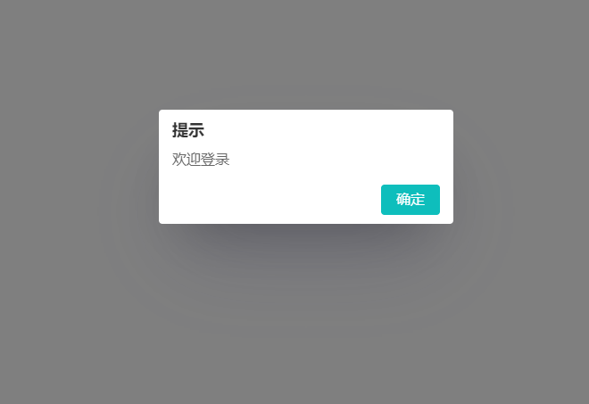

# alert.js & confirm.js

> The English README is translated from Chinese. If there are any errors, please submit the issue.

Create more beautiful and customizable alert/confirm dialogs in the browser. (The current version guarantees normal function in IE browser, but there are slight differences in style.)

[ChangeLog](./ChangeLog.md)

## How to use

Copy the alert and confirm folders 📁 from the lib directory to your project and include their CSS and JS in your HTML where you need to use them.

Here is a simple example using the alert function:

1. Include the styles and scripts

```html
<!-- Include the CSS and JS for alert.js -->
<link rel="stylesheet" href="lib/alert/alert.css" />
<script src="lib/alert/alert.js"></script>
```

2. Call the function where needed

```js
showAlert("Welcome to login", {
  title: "Notice",
  okText: "Confirm",
  onOk: function () {
    // Callback function for when the confirm button is clicked
    console.log("User clicked confirm");
    // Perform other actions...
  },
});
// The showAlert and showConfirm methods are non-blocking, meaning they will not stop the code from executing.
// You can continue to execute other code without waiting for the alert pop-up to close.
```



The usage for confirm is the same, just the method name and configuration options used when calling are different.

## Configuration options

Below are the parameter documents for the `showAlert` method:

| Parameter        | Type                | Description                                              |
| ---------------- | ------------------- | -------------------------------------------------------- |
| message          | string              | Message for the alert                                    |
| options          | object              | Options object                                           |
| options.title    | string (optional)   | Title of the pop-up, default is 'Notice'                 |
| options.okText   | string (optional)   | Text for the confirm button, default is 'Confirm'        |
| options.onOk     | function (optional) | Callback function for when the confirm button is clicked |
| options.onCancel | function (optional) | Callback function for when the cancel button is clicked  |

Below are the parameter documents for the `showConfirm` method:

| Parameter          | Type     | Description                                              |
| ------------------ | -------- | -------------------------------------------------------- |
| message            | string   | Message for the confirm pop-up                           |
| options            | object   | Options object                                           |
| options.title      | string   | Title of the pop-up, default is 'Notice'                 |
| options.okText     | string   | Text for the confirm button, default is 'Confirm'        |
| options.cancelText | string   | Text for the cancel button, default is 'Cancel'          |
| options.onOk       | function | Callback function for when the confirm button is clicked |
| options.onCancel   | function | Callback function for when the cancel button is clicked  |

## Encountered a problem

If you encounter any problems while using this plugin 🙋, please submit an issue or contact me via email 📪.

Some common questions and answers:

- Why is the code using `var` instead of `let` or `const`?

  - This is because `var` is an ES5 syntax and has better support for older browsers. This is also why callbacks are used instead of Promises.

- Why use new names instead of overwriting the native `alert` and `confirm` methods?

  - These are global variables and may be overwritten by other libraries, using new names can avoid this problem. Additionally, overwriting native methods is not a good practice.
